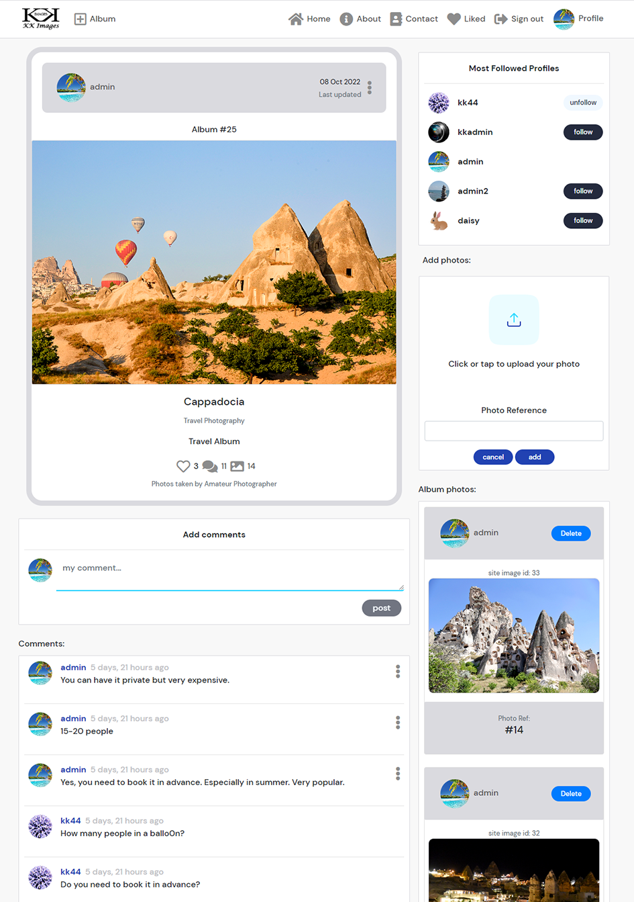

# KK Images

KK Images is a free online service for photographers who want to showcase their works. There are no restrictions on the photographer's skills to register and post their works. Non photographers can also register to the site and follow the photographers. They can like and leave comments to the works posted by the photographers.

This platform also can be used to share photography experiences, techniques, looking for a photographer and general discussions. The registered photographers on this site can be contacted when they leave an email address in their profile page.

Click [here](https://kkimages.herokuapp.com/) to access the frontend of the live site.

Click [here](https://kkimages-drf-api.herokuapp.com/) to access the backend of the live site.

*Screenshot - Mockup on KKImages App, generated from [Multi Device Website Mockup Generator](https://techsini.com/multi-mockup/index.php)*

---
## Table of Contents
* [Objectives](#objectives)
    * [Application Goals](#application-goals)
    * [User Goals](#user-goals)
* [Application Design](#application-design)
    * [React Application](#react-application)
    * [Initial Design](#initial-design)
        * [Wireframe Designs](#wireframe-designs)
    * [Design Approach](#design-approach)
        * [User Stories](#user-stories)
        * [Kanban Board](#kanban-board)
    * [Final Design](#final-design)
* [Application Site Map](#application-site-map)
* [Project Requirements](#project-requirements)
* [Features](#features)
* [Future Features](#future-features)
* [ESLint Checker](#eslint-checker)
* [CSS Validator Testing](#css-validator-testing)
* [Lighthouse Reports](#lighthouse-reports)
* [Testing](#testing)
    * [Automated Testing](#automated-testing)
    * [Manual Testing](#manual-testing)
* [Bugs](#bugs)
* [Deployment](#deployment)
* [Tools](#tools)
* [Credits](#credits)
* [Acknowledgment](#acknowledgment)

---
## Objectives

The main objective of this site is to provide a platform for photographers to showcase their works online. The frontend and backend of this site has been built separately and use React and Django Rest Framework for the frontend to access the backend API.

The target audients are split into photographers and general users.

* Photographers – create and maintain photo albums
* General user – view photo albums, follow photographers, like and leave comments to photo albums

### Application Goals

* Create a community for photographers to share their works and potentially get hired to commission a job
* A platform that allows hobbyists to browse and get inspirations from the works posted by the photographers
* A platform that allows user to find and hire a photographer
* A platform to share experiences, photography techniques and general discussions.

### User Goals

* Any users can view posts on the site.
* Signup to create albums with photos.
* Registered users can maintain their personal profile and albums.
* Registered users can leave comments, like albums and follow other users.

*[Back to Contents](#table-of-contents)*

---
## Application Design

This part of the project is to design a frontend of to provide a user interface application for accessing the data from the backend. As mentioned in the objectives, the frontend application will be built using React.

### React Application

React is a powerful, open source JavaScript library used to create fast and interactive user interfaces. React applications are built by composed with small JavaScript components usually written in a special JavaScript syntax called JSX.

Individual components are completely independent of one another and each component act like a miniature web application. It has the ability to make HTTP requests, communicate with servers and APIs, communicate with one another, and update themselves in response to user interactions

React is responsible for the way the application looks and feels. Application user interface has multiple components and each component responsible small part of the user interface like a navigation menu, an individual tweet or post, a button, or a form. All components are completely independent of one another, and this means that individual parts of the user interface can update independently and in real time, without refreshing the page.

Components are also reusable, which means it can be reused over and over throughout the application.

By coupling it with a full stack framework like Django, you can build powerful full stack applications with interactive, asynchronous front ends capable of being completely disconnected and independent from the back end.

### Initial Design

This project will follow the React philosophy by building reusable components and coupling to the Django Rest Framework project https://kkimages-drf-api.herokuapp.com/

#### Wireframe Designs

The following are initial wireframe designs to meet the main objective.

*Wireframe - Home Page*

*Wireframe - Example of an Album Detail Page with Photos*

*Wireframe - Album Comments Page*

*Wireframe - Albums by Profile Page*

### Design Approach

The development approach on this project is based on the Principles of Agile and use the common agile practices.

The design has broken down into User Stories and grouped into Epics. Each User Story has been allocated its priority, story point and set acceptance criteria and tasks. Timeboxing approach will be used to process the product backlog.

#### User Stories

There are 41 user stories identified for the frontend at the beginning of the project and they were grouped into 9 Epics as listed in the table below

**[User Stories Full Detailed Report (Click to view)](readme/user-stories/user-stories.md#user-stories)**

*Summary of Epics and User Stories*

#### Kanban Board

In development, Kanban Board was used to schedule the execution of the user stories. This approach allows to allocating user stories by priority and monitoring each user story's progress.

The Kanban board below shows all the user stories were initially in the 'To Do' list column. Then at different stage of the development, each one is moved into 'In Progress' column and finally into 'Done' column when it has completed. All user stories that are not included in this iteration are moved into 'Out of Current Scope' column.

*Snapshot of the Kanban Board*

### Final Design

As mentioned, React applications are built by breaking the application into smaller components. These components can be reusable and act independently from each other.

In this application we have common and reusable components that can be found on different part of the application. These components are

* Asset – this is an animation of a spinner used for components that being loading on the page or file path or message
* Avatar – user profile data is pass to this component to display the username and profile image
* Code404 – display page not found when encounter a 404 error
* DeletConfirmation – display alert and confirmation message to user when performing delete actions.
* MoreDropdown – dropdown menu options on another component
* NavBar – Navigation bar for all pages

The following components are more specific to the pages of the application. Since the components are independent to each other then we can rearrange the position of the components on the page. For example, in the comment page we make the comments component as priority and listed below the album cover.

**abouts component**
* AboutPage – rendering the about page

**albums components**
* Album – rendering and perform actions on individual album cover
* AlbumCommentsPage – rendering the detail page of the album with priority in comments component
* AlbumCreateForm – a form to add album to the site
* AlbumEditForm – a form to edit an album
* AlbumListPage – rendering the albums to the home page
* AlbumPage – rendering the detail page of the album with priority in photos component
* Albums – toggle in between desktop or mobile rendering
* PopularAlbums – rendering the most liked albums

**auth components**
* SignInForm – a form for sign in
* SignUpForm – a form for sign up

**comments components**
* Comment – rendering and perform actions on individual comment 
* CommentCreateForm – a form to add comment
* CommentEditForm – a form to edit comment
* CommentMobile – display link to comments page on mobile devices

**contacts components**
* ContactEditForm – a form to edit a contact
* ContactPage – rendering a contact page and check user staff status

**photos components**
* Photo – rendering individual photo
* PhotoCreateForm – a form to add new photo to album

**profiles components**
* PopularProfiles – rendering and perform actions on most followed profiles
* Profile – individual profile username, avatar and follower actions
* ProfileEditForm – a form to edit and update user profile
* ProfilePage - rendering profile page with associated albums
* UsernameForm – a form to edit and update username
* UserPasswordForm – a form to update password

*[Back to Contents](#table-of-contents)*

---
## Application Site Map
The following diagram is the basic navigation site map from the navigation menu. In addition, user can reach to the same page from different part of the application by clicking the common icons like comments and image. For example, user can navigate to user profile page where ever they clicked the user avatar icon.

*[Back to Contents](#table-of-contents)*

---
## Project Requirements

This project has been developed using Python Django Rest Framework, ReactJS, Bootstrap and Deployed in Heroku. The following are the project requirements in order to run the application.

ReactJS and bootstrap are mainly used to develop the frontend of this application.

* ReactJS - open source JavaScript library
* Bootstrap v4.6.0 - an open-source CSS framework directed at responsive, mobile-first front-end web development.
* React Bootstrap - replaces the Bootstrap JavaScript
* Axios - Promise based HTTP client for the browser and node.js
* JSON Web Tokens - industry standard for representing claims securely between two parties
* Heroku - a platform as a service that enables developers to build, run, and operate applications entirely in the cloud.

The following user stories has been implemented to setup the project environment.

* ***[User Story #1 - Create and setup initial workspace](readme/user-stories/frontend-user-story-1.jpg)***
* ***[User Story #2 - Create Initial Project to host the Frontend](readme/user-stories/frontend-user-story-2.jpg)***

*[Back to Contents](#table-of-contents)*

---
## Features

### Navigation Bar

All pages have a navigation bar. The items on the navigation bar depends on the user status as show below.

* For signed out user: Create album, Liked and Profile icons are not available but an option to Sign in or Sign up to the site.

* For signed in user: Sign in and Sign up icons are replaced with Sing out icon with additional Create Album, Liked and user Profile icons.

*Signed Out User Navigation Bar*

*Signed In User Navigation Bar*

The following user stories has been implemented in this section.

* ***[User Story #6 - Logged in status](readme/user-stories/frontend-user-story-6.jpg)***
* ***[User Story #17 - Navigation Bar](readme/user-stories/frontend-user-story-17.jpg)***
* ***[User Story #18 - Routing](readme/user-stories/frontend-user-story-18.jpg)***
* ***[User Story #19 - Conditional Rendering](readme/user-stories/frontend-user-story-19.jpg)***

### Create A New Album

Albums can be created for signed up users. This option only available when user signed in to the site and the Create Album button will appear on the navigation bar.

A form will be presented as show below image when the user clicked on the button.

The user required to upload an image, input a title and skill level in order to create a new album. These mandatory fields will be validated when the user clicked the create button messages will be returned when the validation is failed.

A new album will be created and display on the album detail page when passed the validation check.

*Form to Create A New Album*

The following user story has been implemented for this part of development.

* ***[User Story #20 - Create Albums](readme/user-stories/frontend-user-story-20.jpg)***

### Home Page

This page list all the albums created by all users. The most recent updated album will be listed at the top and the user can scroll down infinitely until it reached to the last album.

The following user stories has been implemented in this section.

* ***[User Story #3 -General browser](readme/user-stories/frontend-user-story-3.jpg)***
* ***[User Story #24 - View most recent albums](readme/user-stories/frontend-user-story-24.jpg)***
* ***[User Story #26 - Albums Infinite scroll](readme/user-stories/frontend-user-story-26.jpg)***

*Example of Home page*

#### Search Bar

On this page it has a search bar above the list of photo albums ("Album Covers"). User can search by keyword from Title, username and type of photography.

* ***[User Story #25 - Search Album](readme/user-stories/frontend-user-story-25.jpg)***

#### Album Cover

Each album has the following contents listed from top left of the album cover:

* User profile avatar and username

    A link to the user profile page. Signed in user can view and owner can edit their profile by clicking on this icon. See below section on [Profile Page](#profile-page) for more detail.

* Last updated date

    Date when the album is last updated by the owner.

* Album reference number

    Site album reference id.

* Album cover image

    The photos for the album will be loaded when user clicked in image area. See [Album Photos](#album-photos) section for more details.

* Album title

    Album title description.

* Type of photography

    Photography category from list.

* Album description

    Description about the album.

* Like and count button

    Signed in user can like or unlike album by clicking the heart icon. Also show the total likes from all user to this album. Tooltip reminder that owner cannot like their own albums.

* ***[User Story #27 - Like and unlike albums](readme/user-stories/frontend-user-story-27.jpg)***

* Comment and count button

    Signed in user can comment album by clicking the comment icon. See [Album Comments Page](#album-comments-page) section for more details. It also shows the total comments from all user to this album.

* Photo and count button

    Signed in user can see the album photos by clicking the image icon. See [Album Photos](#album-photos) section for more details. It also shows the number of photos for this album. 

* Photography skill level

    Indicate the skill level of the photographer who taken the photos in this album.

#### Sidebar Components

There are two components on the sidebar on this page

* Most Followed Profiles

    This component lists the top 5 most followed profiles or 4 on mobile devices. Signed in user can follow or unfollow the profiles from this list. Other profiles can be followed or unfollowed by going into the user profile by selecting the profile’s avatar in the album. 

* ***[User Story #15 - Popular profiles](readme/user-stories/frontend-user-story-15.jpg)***
* ***[User Story #16 - Follow user](readme/user-stories/frontend-user-story-16.jpg)***

* Most Liked Albums

    This component lists the top 5 most liked albums or 4 on mobile devices. This is determined by number of likes in each album and user can like or unlike the album from the album cover.

* ***[User Story #22 - Poplar Albums](readme/user-stories/frontend-user-story-22.jpg)***

### Album Photos

This is a detail page of the album. The album cover will be loaded at the top of the page and the contents are the same as in the list page. The only additional item on the cover is Three Dots menu bar is available to the album owner. The menu lets the owner to edit or delete the album.

***[User Story #21 - Edit and Delete Albums](readme/user-stories/frontend-user-story-21.jpg)***

*Expanded Three Dots Menu Bar for the album owner*

*Album Edit Form for the album owner*

A form to insert photos into the album will only show on this page to the owner for adding new photo to the album.

*Form For adding Photo to the album and Photo Delete Button*

Underneath the album covers there is an album photo gallery section and the following user stories have been implemented.

* ***[User Story #28 - Albums Photos](readme/user-stories/frontend-user-story-28.jpg)***
* ***[User Story #29 - Add Photos](readme/user-stories/frontend-user-story-29.jpg)***
* ***[User Story #30 - Delete Photos](readme/user-stories/frontend-user-story-30.jpg)***
* ***[User Story #32 - Album Photos Infinite scroll](readme/user-stories/frontend-user-story-32.jpg)***

In this section there are three possible results:

* Ask user to sign in to see the photos
* No photos have been uploaded yet
* A list of photos and the user can infinitely scroll down till the end of the photos in the album. The most recent added photos will be listed from the top in descending order.

Each photo has the following contents:
	
* User profile avatar and username
    
    A link to the user profile page. Signed in user can view and owner can edit their profile by clicking on this icon. See below section on [Profile Page](#profile-page) for more detail.

* A Delete button is available to the album owner for deleting this photo from the album

* A site image id

    Internal site reference id to this photo image

* Photo Image area

    An area to show the uploaded image

* Photo ref:

    Owner can input any reference or description to this photo

#### Sidebar Components

There are three components on the sidebar on this page

* Most Followed Profiles

    This component lists the top 5 most followed profiles or 4 on mobile devices. Signed in user can follow or unfollow the profiles from this list. Other profiles can be followed or unfollowed by going into the user profile by selecting the profile’s avatar in the album. 
 
* Most Liked Albums

    This component lists the top 5 most liked albums or 4 on mobile devices. This is determined by number of likes in each album and user can like or unlike the album from the album cover.

* Comments
    A list of comments will be shown here in descending order by date. Signed in user can leave comments about the album and the owner of the comment can edit and delete their own comments.

*Example of Album Photos Page*

*Example of Album Owner Photos Page*

### Album Comments Page

This is another detail page of the album. Instead of listing the photos underneath the album it will be replaced with the comments left by the users to this album. The list of photos is now become the sidebar component. All functionality remains the same as in album photos and the following user stories have been implemented.

* ***[User Story #34 - View Comments](readme/user-stories/frontend-user-story-34.jpg)***
* ***[User Story #35 - Add Comments](readme/user-stories/frontend-user-story-35.jpg)***
* ***[User Story #36 - Edit Comments](readme/user-stories/frontend-user-story-36.jpg)***
* ***[User Story #37 - Delete Comments](readme/user-stories/frontend-user-story-37.jpg)***
* ***[User Story #38 - Album Comments Infinite scroll](readme/user-stories/frontend-user-story-38.jpg)***

*Example of Album Comments Page*

*Example of Album Owner Comments Page*

### About Page

This page gives a general overview about the site and its purposes.

***[User Story #39 - About Page](readme/user-stories/frontend-user-story-39.jpg)***

*About page*

### Contact Page

This page provides the contact details of the company. User can click on the email link and the email client will open with the address. It also provides a list of contacts from different department. Current feature only allow staff to edit the company details through this page. An edit button is available when a staff is signed in to this site otherwise this button is not available to other users.

***[User Story #40 - Contact Page](readme/user-stories/frontend-user-story-40.jpg)***

*Example of Contact page*

An edit form is available to update the company details when the edit button is clicked by a member of staff id. The company record has been set to 1 for the department id.

*Form to Edit Company Details*

### Liked Page

When a signed in user clicked on the Liked icon on the navigation bar. The album list page will be filtered and loaded with list of albums that have been liked by current user.

*Example of liked albums*

### Sign in Page

This page allows the user to sign in to the site. Validation check will be carried out with detected error messages.

*Form to Signing in*

***[User Story #5 - Sign in and Sign out](readme/user-stories/frontend-user-story-5.jpg)***

***[User Story #7 - Refreshing access tokens](readme/user-stories/frontend-user-story-7.jpg)***

### Sign up Page

This page allows the user to sign up to be a member of the site. Validation check will be carried out with detected error messages.

*Form to Signing up*

***[User Story #4 - Sign up](readme/user-stories/frontend-user-story-4.jpg)***

### Profile page

When a user clicks on a profile, the page will be filtered and loaded with the albums belong to the selected profile. The page also shows the details about the selected profile as below:

* Profile avatar
* Username
* Name
* Email – link to email client
* Number of Albums
* Number of Followers
* Number of Following
* Biography

    *Name, email and Biography only shows when there are data in these fields.*

The following user stories has been implemented in this section.

* ***[User Story #8 - View and Edit Account Profile](readme/user-stories/frontend-user-story-8.jpg)***
* ***[User Story #10 - Update Password](readme/user-stories/frontend-user-story-10.jpg)***
* ***[User Story #12 - Avatar](readme/user-stories/frontend-user-story-12.jpg)***
* ***[User Story #13 - View user profiles](readme/user-stories/frontend-user-story-13.jpg)***
* ***[User Story #14 - View Owner's Albums](readme/user-stories/frontend-user-story-14.jpg)***

*Example of Profile Page*

A three dots menu bar is also available for the owner of the profile.

* Allows to edit profile
* Change Username
* Change password

*Expanded Three Dots Menu Bar*

*Form to Edit Profile*

*Change Profile Username*

*Change Profile Password*

### Responsive Design

This application has been designed to response to different devices. The functionality will be the same as on mobile devices. The only difference is the side components will be displayed on the top as shown below:

*Example of Mobile Home Page*

*Example of Mobile Album Photos Page*

*[Back to Contents](#table-of-contents)*

---
## Future Features

Refactoring code - There are possible codes in this phase of the project can be refactored to improve performance.

The won’t have stories in this phase of the project can be developed as future features.

* ***[User Story #9 - Delete account](readme/user-stories/frontend-user-story-9.jpg)***
* ***[User Story #11 - Reset Password](readme/user-stories/frontend-user-story-11.jpg)***
* ***[User Story #23 - Private Album](readme/user-stories/frontend-user-story-23.jpg)***
* ***[User Story #31 - Private Photos](readme/user-stories/frontend-user-story-31.jpg)***
* ***[User Story #33 - Like and unlike photos](readme/user-stories/frontend-user-story-33.jpg)***
* ***[User Story #41 - Administration Site](readme/user-stories/frontend-user-story-41.jpg)***

In addition, the user interface for the popular profiles and popular albums can be improved by reload automatically with a new list when the user alters the follower and like status.

In the liked page, maybe need to reload a new list of albums when user unlike an album from the list.

Expand the functionality in the contacts component. This section can be including a list of the photographers wish to be listed with their details. Then users can search and contact the photographers by skill, type, location etc.

*[Back to Contents](#table-of-contents)*

---
## ESLint Checker

The ESLint plugin has been installed into the development environment as instructed from the following resources.

The settings and rules have been updated in the '.eslintrc.js' file. One of the rules is to ignore the warning on passing children as a prop. The syntax of the infinite scroll was based on the Code Institute's moment walkthrough project. The correct syntax needs to be address in the next phase of the project.

[https://github.com/jsx-eslint/eslint-plugin-react](https://github.com/jsx-eslint/eslint-plugin-react)

[https://eslint.org/docs/latest/user-guide/getting-started](https://eslint.org/docs/latest/user-guide/getting-started)

Based on the eslint setup, all codes have passed the checker as show below.

*[Back to Contents](#table-of-contents)*

---
## CSS Validator Testing

Validator testing is used to validate codes that are legally written and to identify any possible errors. This can be done by using online automated testing tools to scan through the codes. The tools used for this project are

* W3C CSS Validation Service to validate CSS - https://jigsaw.w3.org/css-validator/

The source code can be copied and paste directly into the validator to perform the test. A report will be generated with the test results where it identified the errors. The validator will show passed when the code is free of error.

***All css files from this application have been gone through this validation test and no errors have been found.***

*[Back to Contents](#table-of-contents)*

---
## Lighthouse Reports

Lighthouse is an open-source, automated tool for improving the performance, quality, and correctness of your web apps.

All the possible pages on this application have undergone the Lighthouse tests in desktop and simulated mobile device.

The overall performance is acceptable but possible improvement can be made and accessibility of the site is good.

All reports can be viewed from the link below.

**[Lighthouse Reports (Click to view)](readme/lighthouse/lighthouse.md#lighthouse-reports-for-kkimages-project)**

*[Back to Contents](#table-of-contents)*

---
## Testing

Manual testing was mainly performed against this project with limited automated test cases.

### Automated Testing

The following are the test cases and the test scripts can be found in the __tests__ directory under components:

**1 About.test.js**
* Test renders about

**2 Albumtest.js**
* Test renders Album

**3 NavBar.test.js**
* Test renders NavBar
* Test renders link to the user profile for logged in user
* Test renders Sign in and Sign up buttons again on log out
* Test renders to the user liked albums for logged in user
* Test renders links to create album, about and contact

All tests ran successfully as shown below.

### Manual Testing

Functional testing on this project has been carried out by executing the test scripts as defined below in the test report.

All test results were as expected.

**[Manual Tests Report (Click to view)](readme/testing/testing.md#manual-testing-for-kkimages-project)**

*[Back to Contents](#table-of-contents)*

---
## Bugs

It has been noticed that the position of the album details page did not returning to the top on mobile devices. It seems when the user scrolls down the page on the album list and select an album. The returning page on the album detail page (i.e the photos) seems to be on the same position on the page and did not start from the top. This only happening on mobile device and needs to be address in the next phase of the project.

It has been noticed that the site does not allow user to sign in under Incognito window. It seems there is a problem with the refresh token. Further investigation is required to resolve this issue.

*[Back to Contents](#table-of-contents)*

---
## Deployment

Before the final deployment. The application needs to be tidy up.

* Remove react StrictMode
* Make sure refresh access token is in placed by installing Json Web Tokens to access the timestamp within the response.
* Optimized bootstrap imports
* Remove all console.log but it can be commented it out in the catch blocks as suggested in the tutorial.

In package.json file, in the “scripts” section, add the following prebuild command:
* "heroku-prebuild": "npm install -g serve",

Create a Profile with the following web command
* web: serve -s build

Once all the above have been carried out then push the code to github and deploy in heroku.

* Log in to heroku.com and open the dashboard for this react application
* Select the “Deploy” tab in the dashboard
* Scroll down to the bottom and then select “Deploy Branch”
* Wait for your build to complete
* Check message in the build log. It should be successfully “deployed to Heroku
* Click the “open app” button at the top of the page
* Test the application and should behave as expected

*[Back to Contents](#table-of-contents)*

---
## Tools
The tools used to carry out the development and deployment on this project are:
* Gitpod and Github
* ReactJS open source JavaScript library
* Webpage Screenshots - Chrome app extension (FireShot)
* CSS Validator
* [Lucid Chart](https://www.lucidchart.com/) for creating flow chart
* [ESlint checker](https://eslint.org/docs/latest/user-guide/getting-started) for code validation
* [Heroku](https://id.heroku.com/login) for building, deploying, and managing apps
* [Pixerbay](https://pixabay.com/) for images

*[Back to Contents](#table-of-contents)*

---
## Credits
* This project was inspired and adapted from Code Institute React Moment project
* Template created by Code Institute development framework for the creation of websites and web apps
* [React](https://reactjs.org/docs/getting-started.html) - Getting started with React
* [React Bootstrap](https://react-bootstrap.github.io/) - Home of React Bootstrap
* [Django Rest Framework](https://www.django-rest-framework.org/) - Home for Django Rest Framework
* [Django Documentation](https://docs.djangoproject.com/en/4.0/) - for research and instructions
* [Select Dropdown in React JS With Fetched Data From API](https://www.youtube.com/watch?v=1cYnbYVAi_E) - for create a select dropdown option
* [Code Institute](https://codeinstitute.net/) - Full Stack Framework tutorials

*[Back to Contents](#table-of-contents)*

---
## Acknowledgment

I would like to thank the following to support the development of this site.

* Learning Support - Code Institute
* Mentoring Support - Daisy McGirr