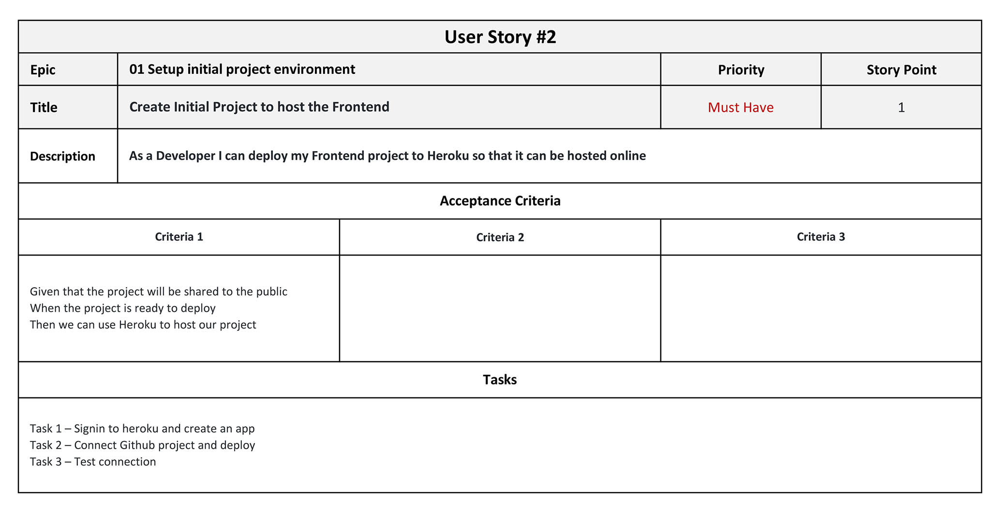
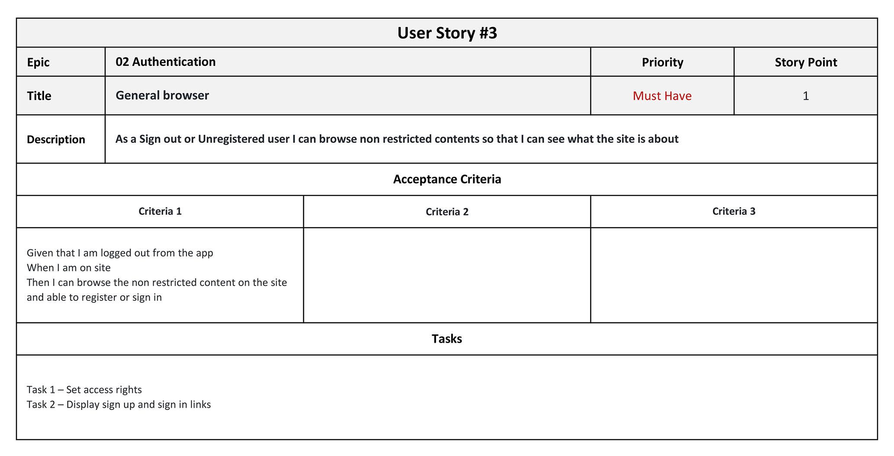
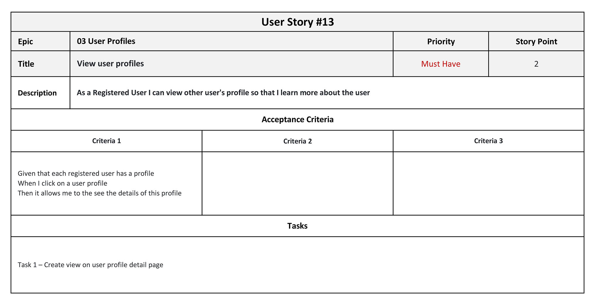
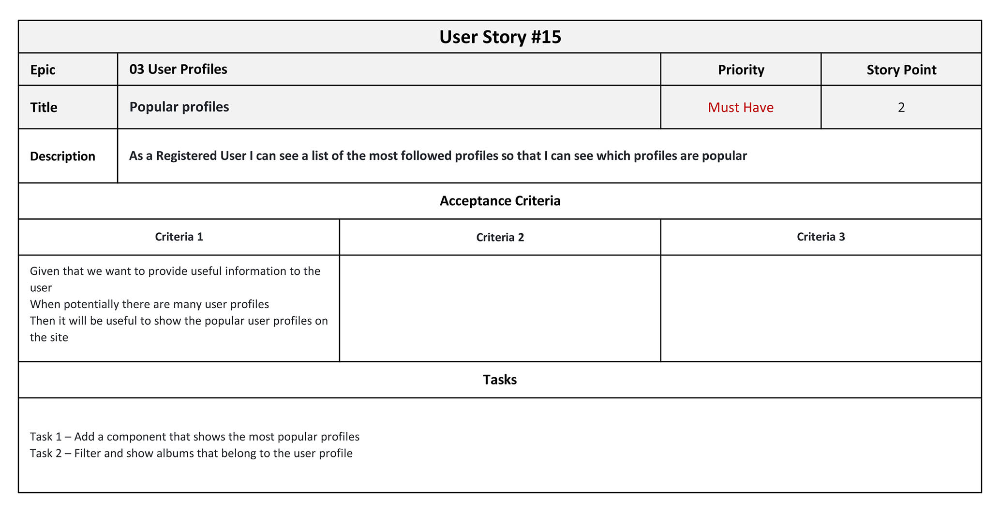
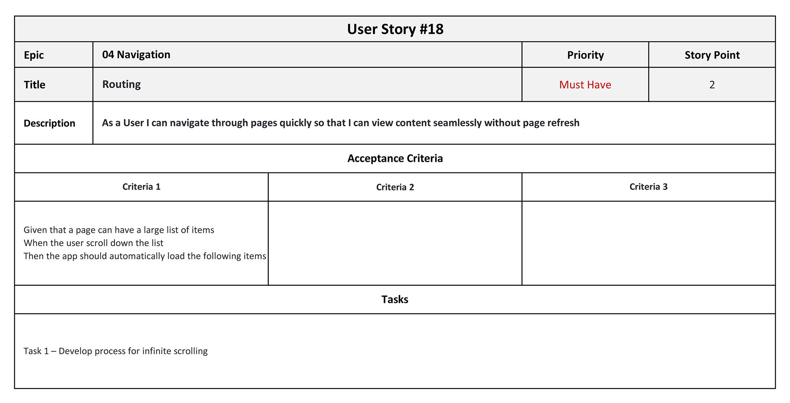
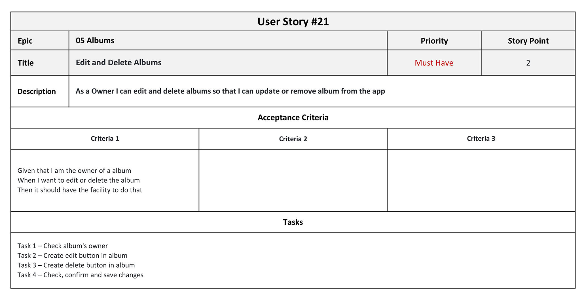
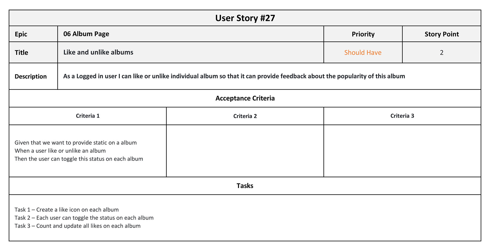
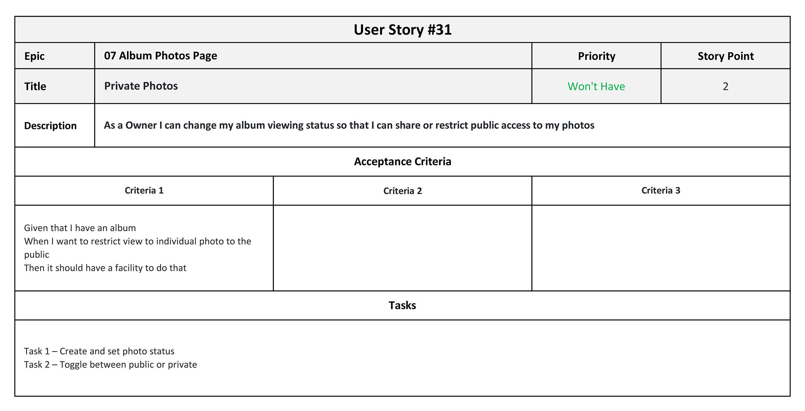
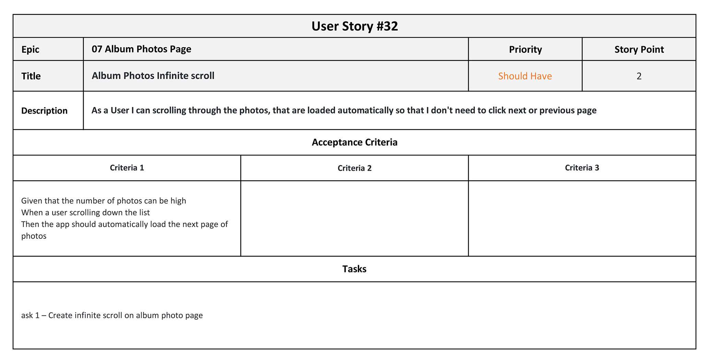
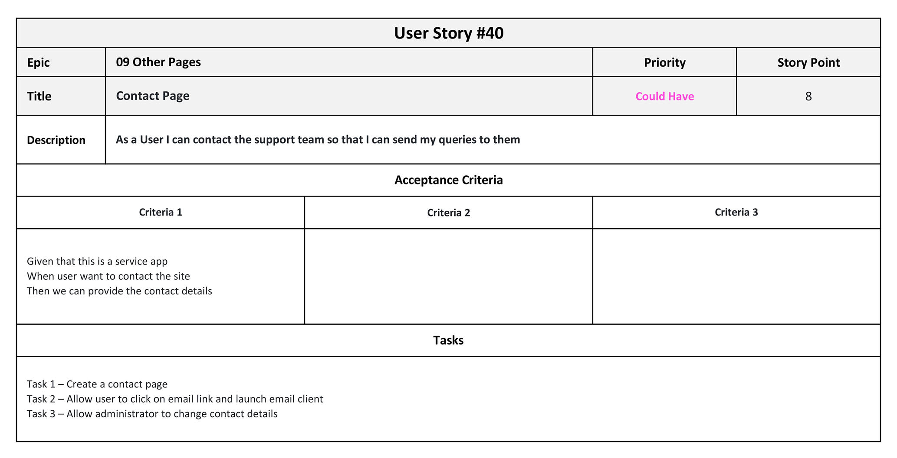

# User Stories

This document list the details of each User Story for the backend of the KKImages project. There are total of 41 User Stories.

Epic - 01 Setup initial project environment

1. [Create and setup initial workspace](#user-story-1)
2. [Create Initial Project to host the Frontend](#user-story-2)

Epic - 02 Authentication

3. [General browser](#user-story-3)
4. [Sign up](#user-story-4)
5. [Sign in and Sign out](#user-story-5)
6. [Logged in status](#user-story-6)
7. [Refreshing access tokens](#user-story-7)

Epic - 03 User Profile

8. [View and Edit account profile](#user-story-8)
9. [Delete account](#user-story-9)
10. [Update Password](#user-story-10)
11. [Reset Password](#user-story-11)
12. [Avatar](#user-story-12)
13. [View user profiles](#user-story-13)
14. [View owner's albums](#user-story-14)
15. [Popular profiles](#user-story-15)
16. [Follow user](#user-story-16)

Epic - 04 Navigation

17. [Navigation Bar](#user-story-17)
18. [Routing](#user-story-18)
19. [Conditional Rendering](#user-story-19)

Epic - 05 Albums

20. [Create Albums](#user-story-20)
21. [Edit and Delete Albums](#user-story-21)
22. [Popular albums](#user-story-22)
23. [Private Album](#user-story-23)

Epic - 06 Albums Page

24. [View most recent albums](#user-story-24)
25. [Search Album](#user-story-25)
26. [Albums Infinite scroll](#user-story-26)
27. [Like and unlike albums](#user-story-27)

Epic - 07 Album Photos Page

28. [Album Photos](#user-story-28)
29. [Add Photos](#user-story-29)
30. [Delete Photos](#user-story-30)
31. [Private Photos](#user-story-31)
32. [Album Photos Infinite scroll](#user-story-32)
33. [Like and unlike photos](#user-story-33)

Epic - 08 Album Comments Page

34. [View Comments](#user-story-34)
35. [Add Comments](#user-story-35)
36. [Edit Comments](#user-story-36)
37. [Delete Comments](#user-story-37)
38. [Album Comments Infinite scroll](#user-story-38)

Epic - 09 Other Pages

39. [About Page](#user-story-39)
40. [Contact Page](#user-story-40)
41. [Administration Site](#user-story-41)

### User Story #1

Return to [Top](#user-stories) of the page or main document [README](/README.md#design-approach)

### User Story #2

Return to [Top](#user-stories) of the page or main document [README](/README.md#design-approach)

### User Story #3

Return to [Top](#user-stories) of the page or main document [README](/README.md#design-approach)

### User Story #4

Return to [Top](#user-stories) of the page or main document [README](/README.md#design-approach)

### User Story #5

Return to [Top](#user-stories) of the page or main document [README](/README.md#design-approach)

### User Story #6

Return to [Top](#user-stories) of the page or main document [README](/README.md#design-approach)

### User Story #7

Return to [Top](#user-stories) of the page or main document [README](/README.md#design-approach)

### User Story #8

Return to [Top](#user-stories) of the page or main document [README](/README.md#design-approach)

### User Story #9

Return to [Top](#user-stories) of the page or main document [README](/README.md#design-approach)

### User Story #10

Return to [Top](#user-stories) of the page or main document [README](/README.md#design-approach)

### User Story #11

Return to [Top](#user-stories) of the page or main document [README](/README.md#design-approach)

### User Story #12

Return to [Top](#user-stories) of the page or main document [README](/README.md#design-approach)

### User Story #13

Return to [Top](#user-stories) of the page or main document [README](/README.md#design-approach)

### User Story #14

Return to [Top](#user-stories) of the page or main document [README](/README.md#design-approach)

### User Story #15

Return to [Top](#user-stories) of the page or main document [README](/README.md#design-approach)

### User Story #16

Return to [Top](#user-stories) of the page or main document [README](/README.md#design-approach)

### User Story #17

Return to [Top](#user-stories) of the page or main document [README](/README.md#design-approach)

### User Story #18

Return to [Top](#user-stories) of the page or main document [README](/README.md#design-approach)

### User Story #19

Return to [Top](#user-stories) of the page or main document [README](/README.md#design-approach)

### User Story #20

Return to [Top](#user-stories) of the page or main document [README](/README.md#design-approach)

### User Story #21

Return to [Top](#user-stories) of the page or main document [README](/README.md#design-approach)

### User Story #22

Return to [Top](#user-stories) of the page or main document [README](/README.md#design-approach)

### User Story #23

Return to [Top](#user-stories) of the page or main document [README](/README.md#design-approach)

### User Story #24

Return to [Top](#user-stories) of the page or main document [README](/README.md#design-approach)

### User Story #25

Return to [Top](#user-stories) of the page or main document [README](/README.md#design-approach)

### User Story #26

Return to [Top](#user-stories) of the page or main document [README](/README.md#design-approach)

### User Story #27

Return to [Top](#user-stories) of the page or main document [README](/README.md#design-approach)

### User Story #28

Return to [Top](#user-stories) of the page or main document [README](/README.md#design-approach)

### User Story #29

Return to [Top](#user-stories) of the page or main document [README](/README.md#design-approach)

### User Story #30

Return to [Top](#user-stories) of the page or main document [README](/README.md#design-approach)

### User Story #31

Return to [Top](#user-stories) of the page or main document [README](/README.md#design-approach)

### User Story #32

Return to [Top](#user-stories) of the page or main document [README](/README.md#design-approach)

### User Story #33

Return to [Top](#user-stories) of the page or main document [README](/README.md#design-approach)

### User Story #34

Return to [Top](#user-stories) of the page or main document [README](/README.md#design-approach)

### User Story #35

Return to [Top](#user-stories) of the page or main document [README](/README.md#design-approach)

### User Story #36

Return to [Top](#user-stories) of the page or main document [README](/README.md#design-approach)

### User Story #37

Return to [Top](#user-stories) of the page or main document [README](/README.md#design-approach)

### User Story #38

Return to [Top](#user-stories) of the page or main document [README](/README.md#design-approach)

### User Story #39

Return to [Top](#user-stories) of the page or main document [README](/README.md#design-approach)

### User Story #40

Return to [Top](#user-stories) of the page or main document [README](/README.md#design-approach)

### User Story #41

Return to [Top](#user-stories) of the page or main document [README](/README.md#design-approach)
